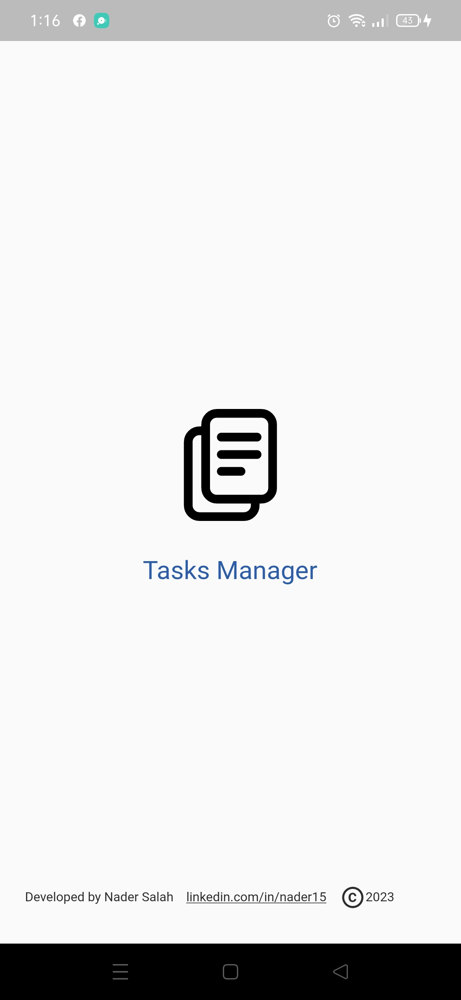
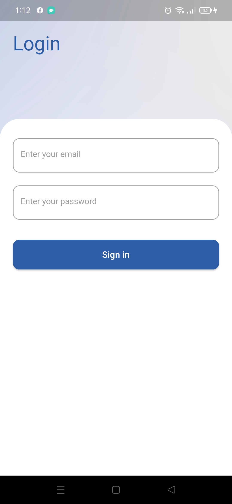
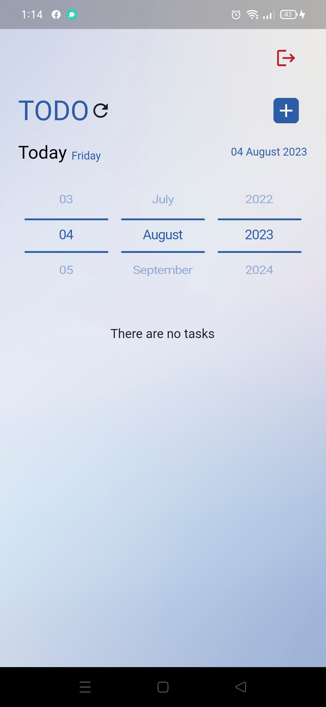
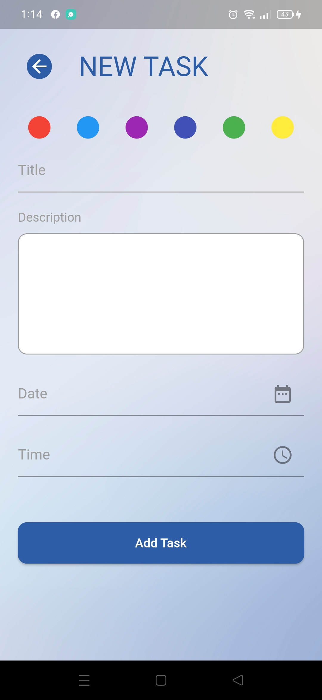
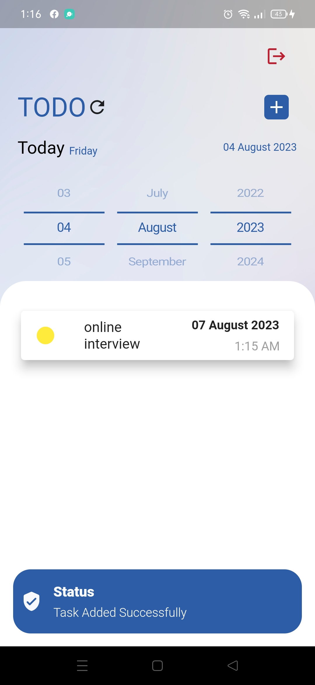
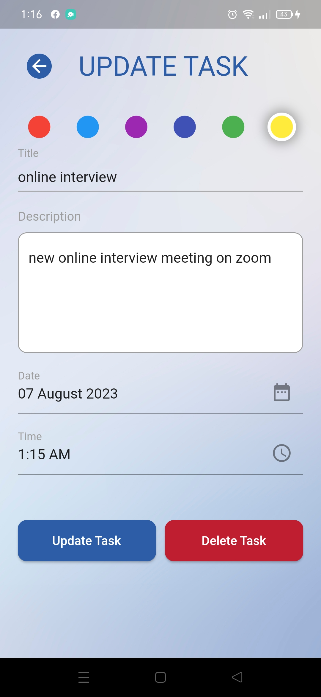

# tasks Manager

An application that can be run on Android and iOS implemented with Dart programming language anf Flutter framework .
The App do The following Features :

TODO List:

1. Store a task in app local storage with details (color, status,title, description, date).
2. Display the list of TODO items.
3. Allow users to edit the properties (color, status, description, date) of existing TODO items.
4. Allow users to remove TODO items from the list.

Notifications:

1. send reminders for TODO items based on their dates.
2. When a TODO item's date is reached, send a notification to the user with the TODO item's information.

Filtering:

1. Allow users to apply filters to display only specific TODO items that match the selected date.

## ScreenShots App Screens

<table>
    <tr>
        <td></td>
        <td></td>
        <td></td>
    </tr>
    <tr>
        <td></td>
        <td></td>
        <td></td>
    </tr>
</table>

## Android Application

Install Application From Google drive [Install](https://drive.google.com/file/d/1ytyd7XsByo6LAQhLO0kXBeY6ok2etFJU/view?usp=sharing)

